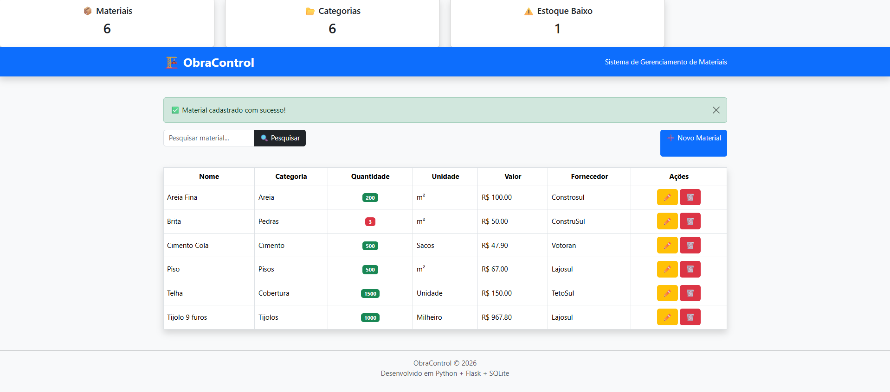
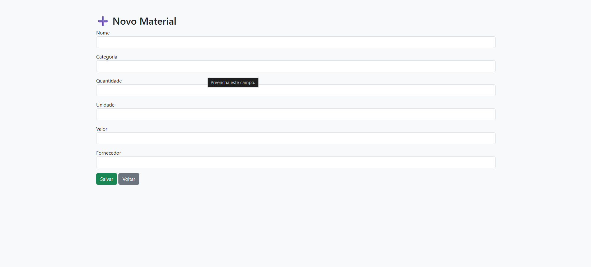
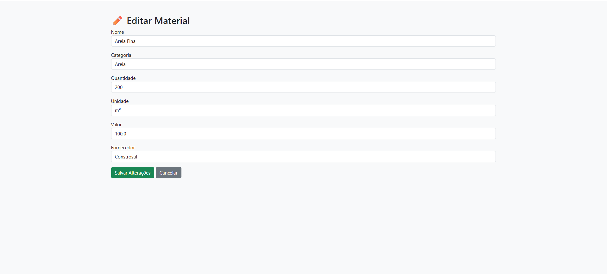

# 🏗️ ObraControl

Sistema web para gerenciamento de materiais de construção, desenvolvido como projeto acadêmico do curso de Análise e Desenvolvimento de Sistemas.

## 📋 Sobre o projeto

O ObraControl permite o controle centralizado de materiais utilizados em obras, com cadastro, edição, exclusão e busca de itens, além de indicadores rápidos de estoque.

### Funcionalidades

- Cadastro, edição e exclusão de materiais (CRUD completo)
- Busca de materiais por nome
- Categorização de materiais (Areia, Cimento, Pisos, Tijolos, etc.)
- Controle de quantidade, unidade de medida, valor e fornecedor
- Alerta visual de estoque baixo
- Painel com indicadores gerais (total de materiais, categorias e itens em estoque baixo)

## 🛠️ Tecnologias utilizadas

- **Python**
- **Flask** — framework web
- **SQLAlchemy** — ORM para modelagem e manipulação do banco de dados
- **SQLite** — banco de dados
- **HTML, CSS, Bootstrap** — interface e estilização

## 📸 Screenshots

**Tela principal**


**Cadastro de material**


**Edição de material**


## 🚀 Como rodar o projeto localmente

```bash
# Clone o repositório
git clone https://github.com/Joao21-dev/obracontrol.git
cd obracontrol

# Crie e ative um ambiente virtual
python -m venv venv
venv\Scripts\activate      # Windows
source venv/bin/activate   # Linux/Mac

# Instale as dependências
pip install -r requirements.txt

# Rode a aplicação
python app.py
```

Acesse em `http://localhost:5000`

## 📌 Status do projeto

Projeto desenvolvido para fins acadêmicos, com possibilidade de evolução futura (relatórios, exportação de dados, integração com Power BI para dashboards de acompanhamento).

## 👤 Autor

João Gabriel Machado da Rosa
[LinkedIn](https://linkedin.com/in/o-joao-machado)
